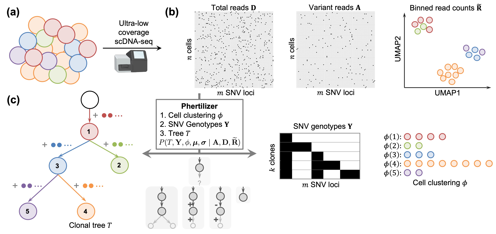

## Phertilizer: growing a clonal tree from ultra-low coverage single-cell DNA sequencing data of tumors
This is the accompanyinying data repository. The Phertilizer code repostiory is located at https://github.com/elkebir-group/phertilizer.

**Phertilizer infers a clonal tree with SNV genotypes and a cell clustering given ultra-low coverage single-cell sequencing data.**
(a) A tumor is composed of groups of cells, or clones with distinct genotypes.
(b) Ultra-low coverage single-cell DNA sequencing produces total read counts and variant read counts for n cells and m SNV loci, and low dimension embedding for the same cells for an input set of binned read counts.
(c) Phertilizer infers a clonal tree, SNV genotypes and cell clustering with maximum posterior probability.

## Available Data
1. DLP+ Ovarian Cell Lines from [Laks et al. (2019)](https://doi.org/10.1016/j.cell.2019.10.026)
2. ACT Breast Tumors from [Minussi et al. (2020)](https://doi.org/10.1038/s41586-021-03357-x)
3. Simulation output files
